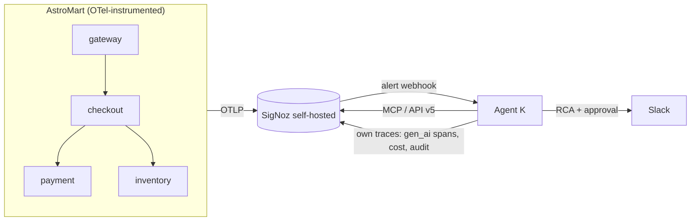

> **Agents of SigNoz** hackathon (WeMakeDevs × SigNoz). Track 1: AI & Agent Observability.
> Repo: https://github.com/100xRahul/agent-k-signoz · Demo video: https://www.youtube.com/watch?v=nJuPxC2Ldyo

I set out to build an AI agent that investigates production incidents. The part I expected to be hard — getting an LLM to reason over traces and logs — turned out to be the easy 20%. The hard 80% was making the agent **trustworthy enough to point at production**: proving its answers are grounded in real telemetry, and making the agent itself observable. This post is about the two bugs that taught me that, and how SigNoz ended up being both the agent's eyes and its accountability layer.

## What I built

**Agent K** is an autonomous on-call SRE. A SigNoz alert fires → a webhook wakes the agent → it investigates through the official **SigNoz MCP server** → it posts a root-cause analysis with business blast radius to Slack → it proposes a guarded remediation behind a one-click approval → and every step it takes is emitted as OpenTelemetry back into the *same* SigNoz instance.

That last clause is the whole idea: **SigNoz observes the agent that observes SigNoz.**

To make this real instead of a toy, I built a small demo shop — "AstroMart," four FastAPI services (gateway → checkout → payment → inventory) with Postgres and Redis — instrumented with OpenTelemetry, plus a chaos CLI that injects five distinct failure signatures (a bad deploy, DB pool exhaustion, a feature-flag conflict, a secret leak, and a healthy control).

> 🖼️ **[IMAGE 1 — Architecture diagram]** _(the mermaid block below renders on Dev.to; on Medium, screenshot it)_



## How SigNoz does the work

The agent never talks to a database directly. It reads everything through the SigNoz MCP server — 14 read-only tools (list services, aggregate traces, search logs, run Query Builder v5, get alert history, and so on). My investigation "playbook" is basically a QB v5 cheat-sheet the model follows:

- **Error rate:** `countIf(has_error=true) / count() * 100` on `service.name = 'checkout'`.
- **Deploy correlation:** group `p99(duration_nano)` and `countIf(has_error=true)` by `service.version` to catch a bad rollout.
- **Blast radius:** `sumIf(order.total, has_error = true)` for failed-order dollars and `count_distinct(user.id)` for affected users.
- **Secret leak:** a regex over log bodies — `body REGEXP 'AKIA[0-9A-Z]{16}'`.

One concrete gotcha worth saving you an hour: in QB v5, `hasAll(...)` works on **log-body JSON, not span attributes**. To isolate my feature-flag conflict on spans I had to use `feature_flags CONTAINS 'new-checkout' AND feature_flags CONTAINS 'express-pay'`, not `hasAll`. The other one: **anchor every query to the alert's fire window** (about 15 minutes before it fired). My first version happily pulled in a *previous, already-resolved* incident and confidently blamed the wrong deploy.

> 🖼️ **[IMAGE 2 — the RCA report]** Screenshot `localhost:9000/reports/<id>`: the green audit badge, the root cause naming checkout v1.4.2, and the Blast Radius section with dollars/users/tenants.

## The bug that taught me what "grounded" means

Here's the part I couldn't have learned from docs. I added a second, independent model — an **auditor** — whose only job is to read the finished RCA and check that every factual claim is backed by the evidence the agent actually collected. Sounds simple. It kept failing my *correct* reports.

The first failure surprised me. My bad-deploy RCA correctly said: *"the checkout v1.4.2 deployment introduced a failure path."* The auditor flagged that exact sentence as **unsupported**. And technically it was right — that sentence appears nowhere in the raw tool output. But that sentence is the *entire point of an RCA*: it's an **inference** from correlated evidence (a deploy marker plus an error spike right after it), not a fact you can grep for. I had to teach the auditor the difference between "this specific number isn't in the evidence" (flag it) and "this is a diagnostic conclusion the cited evidence reasonably supports" (that's the job).

The second failure was subtler and more embarrassing. Even after that fix, the auditor kept flagging the **blast-radius numbers** — the dollar figures and user counts. I was sure those came from real `sumIf`/`count_distinct` queries. They did. The problem: I was truncating the evidence I handed the auditor to the first 45 KB — and blast-radius queries run **last** in the playbook, so their results were beyond the cutoff. The auditor was being asked to verify numbers it literally couldn't see. Switching to a head-and-tail truncation (keep the beginning and the whole end) fixed it.

Both fixes are the kind of thing you only find by running the real thing and reading why it disagreed with you. After them, a correct RCA reliably comes back **grounded**, and the verdict is published as a badge on the report, an `agentk.audit.groundedness` metric in SigNoz, and an alert that fires if an ungrounded RCA ever ships.

> 🖼️ **[IMAGE 3 — Watch the Watcher dashboard]** Screenshot the SigNoz dashboard showing cost per investigation, tokens, MCP tool calls, and the groundedness panel — the agent observing itself.

## A smaller gotcha: GPT-5 and temperature

I ran the agent on `gpt-5-mini`. My whole loop sent `temperature=0` for determinism. Every call 400'd with:

```
Unsupported value: 'temperature' does not support 0 with this model.
Only the default (1) value is supported.
```

The fix was to make temperature optional and simply **omit** it for gpt-5-family models rather than sending `0`. Small thing, but it silently broke every investigation until I read the error instead of assuming the SDK default was fine.

## Measured, not just demoed

A demo proves an agent *can* be right once. I wanted a number. So I wrote a scored benchmark: it drives the real chaos and a firing alert for each fault class, lets the agent run its live investigation, then scores the **stored** verdict deterministically against ground truth — right service, right fault signature, right guarded action — plus a healthy control that measures how often it pages when nothing is wrong. Because scoring keys on the stored facts and the auditor verdict, **a run can't pass on a hallucinated narrative.**

On the five-class run: 100% detection, localization, and classification, 100% groundedness, and **0% false alarms** on the healthy control. The benchmark also earned its keep by *failing first* — it's how I caught a false-alarm scoring bug where my check substring-matched the report template's literal "Regression onset:" line and flagged a perfectly healthy verdict. Honest benchmarks find your bugs before a judge does.

> 🖼️ **[IMAGE 4 — benchmark results]** Screenshot `docs/benchmark/BENCHMARK.md` (the headline table).

> 🖼️ **[IMAGE 5 — Slack]** Screenshot the Slack thread: the RCA, the remediation proposal, the approval, and the verification follow-up.

## What I'd tell my past self

- **The agent is the easy part.** Grounding and observability are where the real work is. An LLM that writes a confident RCA is worth nothing without a way to check it against evidence.
- **Constraining the agent makes it more useful, not less.** One tool surface (the MCP `step`), a cost budget, a guaranteed-finish, and an independent auditor — those constraints are exactly what made it safe to trust the output.
- **The valuable signal is the join.** Neither the client-side error rate nor the server-side rollup is new. Pairing them over the exact incident window is what turns "it got slower" into "checkout v1.4.2 caused a 5xx spike."
- **Instrument your agent like production.** Emitting `gen_ai` spans and a cost metric back into SigNoz meant I debugged the *agent* with the same tools it uses to debug everything else — including an alert where it ends up investigating itself.

## Try it

Everything is one command each: `make up` (SigNoz via committed Foundry manifests + the stack), `make provision` (alerts, dashboards, and saved views as code), `make demo` (inject a bad deploy and watch the agent investigate), `make benchmark`, and `make verify-ledger`. Code and the full benchmark harness are in the repo.

If you're building agents on top of observability data, my one takeaway is this: budget most of your time for the boring, unglamorous 80% — grounding, auditing, and making the agent observable. That's what turns a clever demo into something you'd actually leave running.
