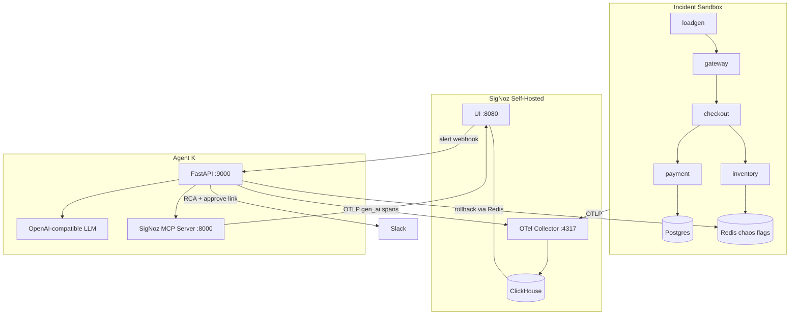

# Architecture — Agent K

```mermaid
flowchart TB
  subgraph sandbox [Incident Sandbox]
    LG[loadgen]
    GW[gateway]
    CH[checkout]
    PM[payment]
    INV[inventory]
    PG[(Postgres)]
    RD[(Redis chaos flags)]
    LG --> GW --> CH
    CH --> PM --> PG
    CH --> INV --> RD
  end

  subgraph signoz [SigNoz Self-Hosted]
    UI[UI :8080]
    COL[OTel Collector :4317]
    CHDB[(ClickHouse)]
    UI --- CHDB
    COL --> CHDB
  end

  subgraph agentk [Agent K]
    AG[FastAPI :9000]
    LLM[OpenAI-compatible LLM]
    MCP[SigNoz MCP Server :8000]
    AG --> LLM
    AG --> MCP
    MCP --> UI
  end

  sandbox -->|OTLP| COL
  AG -->|OTLP gen_ai spans| COL
  UI -->|alert webhook| AG
  AG -->|RCA + approve link| SL[Slack]
  AG -->|rollback via Redis| RD
```

Export this diagram to PNG for the README with any Mermaid renderer or screenshot from GitHub preview.
